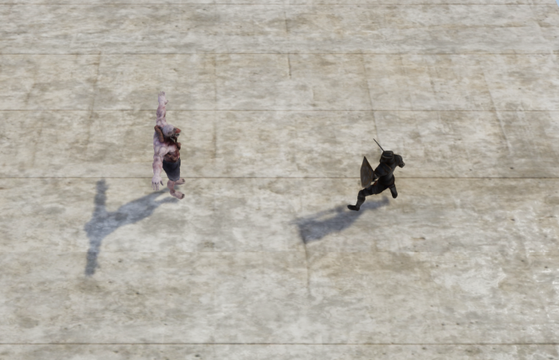
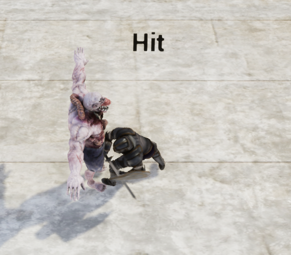
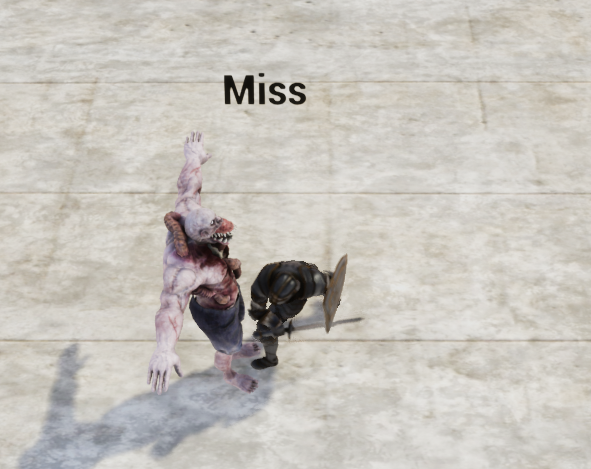

# Roll To Hit Combat System

## Introduction

In this project my aim was to recreate the popular combat system that is featured in table top rpg games such as D&D and many others. The idea is that when an attack is committed, the attack stat of the attacker is added on to a randomly generated number and compared against the defensive skill of the defender. This project features that in the form of a player character that can be ordered to move or attack in the style of many rpgs to this date. The player is given an isometric view and one player character with which they can send to attack an enemy NPC.

# Gameplay

Currently the gameplay includes ordering the player character to move or to attack the enemy NPC. If the PC is ordered to attack by left clicking on the Enemy NPC, the PC will then make its way to the Enemy NPC and once it is in range, it will execute its attack. Once the attack is executed, the random number will be generated within the range of 1 to 20. This number will then have the attackers attack stat added to it and then it will be compared to the defenders defence skill. If the number generated with the attack stat is higher  than that of the defence skill then the attack will land and reduce the health of the defender, if not then the attack will simply miss and nothing will occur.

 
 

# Player Character

The player character contains an isometric camera and a pawn character to control. When the player issues inputs such as right mouse button to move and left to attack a target, these commands are issued to the Player Character controller and then to the player character itself. This style of control and display is reminiscent of rpg games such as Divinity Original Sin, Baldurs gate etc. The player character currently has full animation including idle, running and attacking animation states.

#### Characters
The models and animations shown in the project were sourced from [Mixamo](https://www.mixamo.com/#/)

#### Audio
All audio featured in the project was sourced from [soundbible.com](http://soundbible.com)

#### To Do
Add animation for the Enemy NPC.
Add Ai function to the Enemy NPC so that it can attack the player character on sight.
Add ranged attacks, IE spells or bows for increased variety.

This project was created using UE4 using both visual scripting (blueprint) and code (C++).
